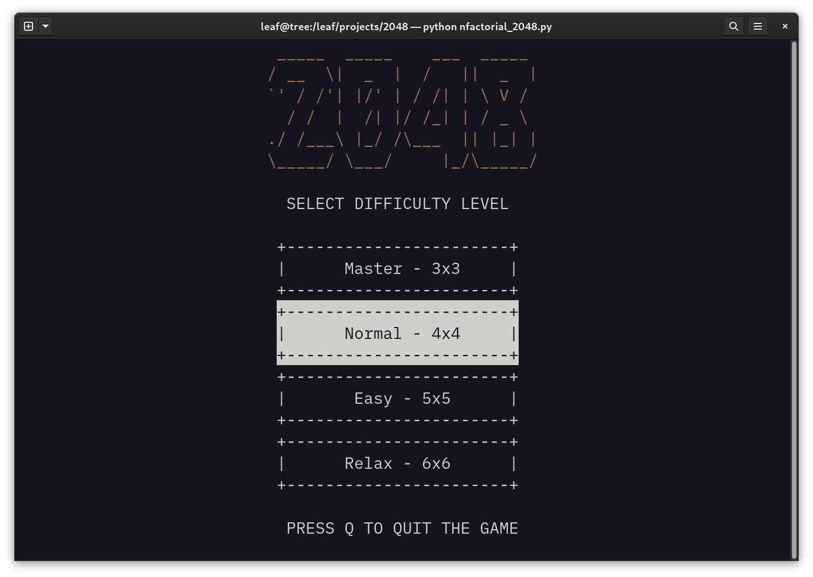
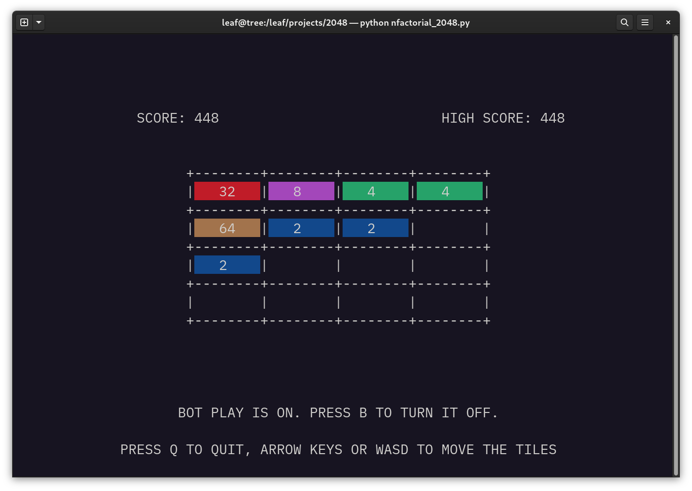

# Gameplay

# How to play
1. Clone this repository
2. Run `python3 nfactorial2048.py`
3. Use `WASD` or arrow keys to move the tiles
4. Press `Q` to quit
5. Press `B` to let the computer play
6. Press `B` again to stop the computer and continue playing
7. Enjoy the game and try to get the highest score!

## Windows
Install the `windows-curses` library with `pip install windows-curses`.
